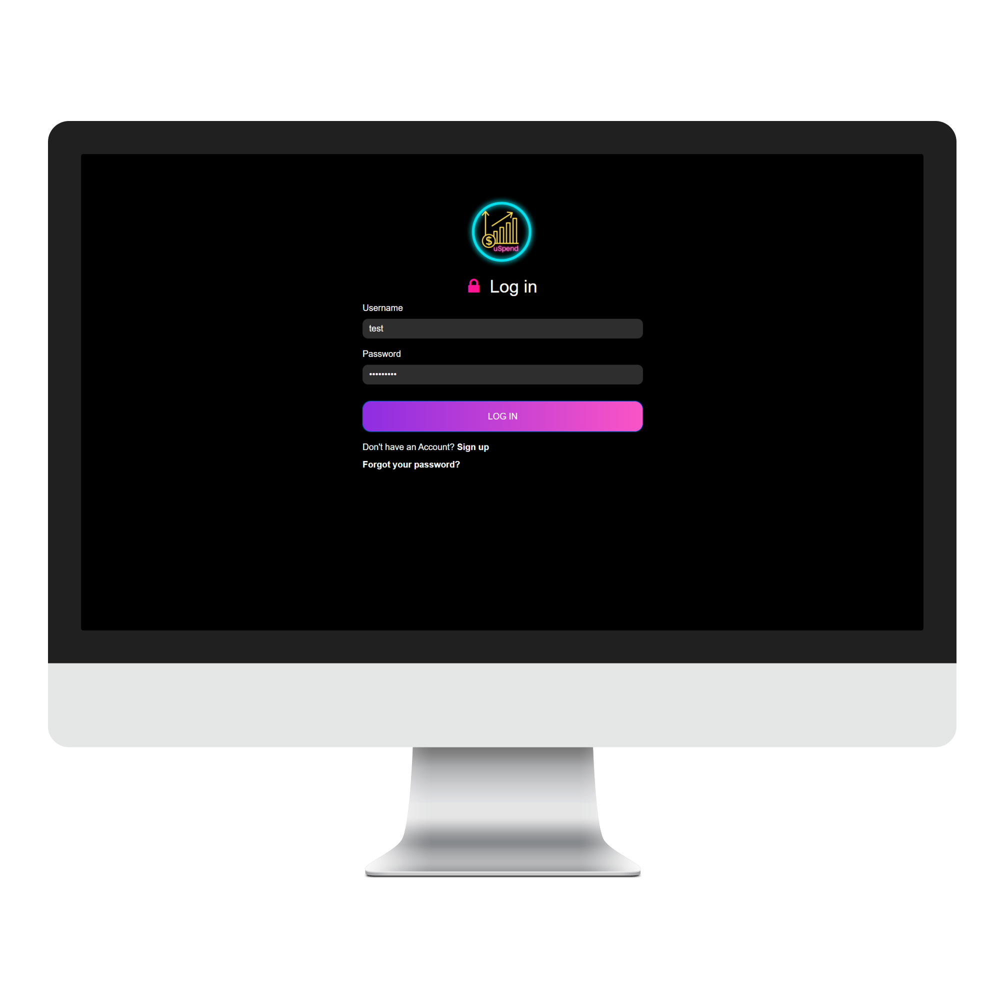

# Pre requisite:
- Python
- Git
# Run using this command:
- git clone https://github.com/Abhishek129/ExpenseManager.git
- cd ExpenseManager
- pip install -r requirement.txt
- py manage.py runserver

# Snapshot:

### Login

