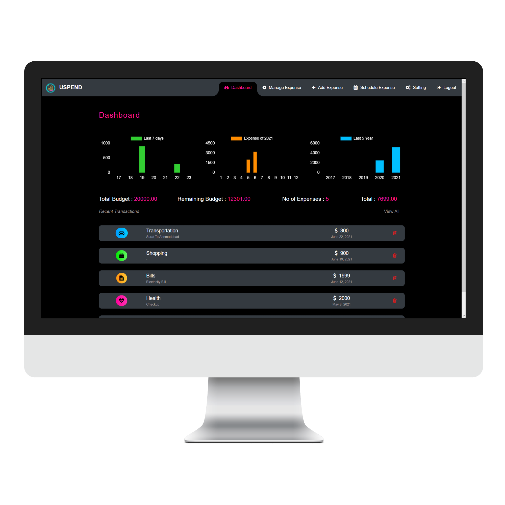

# About Expense Manager
This Application will introduce the simple Expense Managing and Monitoring system. Instead of traditional pen paper system, it will consist of software system, which is easy to use. System will take information regarding to the current expense and will store on database. A display of our software will show the expenselist. According to your expenses, graph will be generated in your application. The main goal is to make it easy to manage your daily expenses which cannot be remembered easily by users.

# Pre requisite:
- Python
- Git
# Run using this command:
- git clone https://github.com/Abhishek129/ExpenseManager.git
- cd ExpenseManager
- pip install -r requirement.txt
- py manage.py runserver

# Snapshot:

### Home

### Login

### Dashboard

### Manage Expense

### Schedule Expense

### Setting

